# Confluent Cloud Terraform Architecture Diagrams

This document contains comprehensive architecture diagrams for the Confluent Cloud Terraform project showing the modular, multi-environment infrastructure.

## 🏗️ Overall Architecture Overview


## 🗂️ Terraform Module Structure


## 🌍 Multi-Environment Resource Flow

```mermaid
flowchart TD
    subgraph Confluent["Confluent Cloud Platform"]
        CC[Environment Management]
        KC[Kafka Cluster lkc-2grjgy]
        SR[Schema Registry lsrc-8rwvr7]
        FP[Flink Compute Pool lfcp-rm50mk]
    end
    
    subgraph NonProd["Non-Production (when using non-prod.tfvars)"]
        DT["Dev Topics:<br/>• aws.myorg.dev.sample_project.dummy_topic.0<br/>• aws.myorg.dev.sample_project.dummy_topic_with_schema<br/>• aws.myorg.dev.sample_project.http_source_data.source-connector"]
        DS["Dev Schemas:<br/>• aws.myorg.dev.sample_project.dummy_topic_with_schema-key<br/>• aws.myorg.dev.sample_project.dummy_topic_with_schema-value"]
        DC["Dev Connector:<br/>HttpSourceConnector_aws-non-prod-cluster_dev_sample_project"]
        
        QT["QA Topics:<br/>• aws.myorg.qa.sample_project.dummy_topic.0<br/>• aws.myorg.qa.sample_project.dummy_topic_with_schema<br/>• aws.myorg.qa.sample_project.http_source_data.source-connector"]
        QS["QA Schemas:<br/>• aws.myorg.qa.sample_project.dummy_topic_with_schema-key<br/>• aws.myorg.qa.sample_project.dummy_topic_with_schema-value"]
        QC["QA Connector:<br/>HttpSourceConnector_aws-non-prod-cluster_qa_sample_project"]
        
        UT["UAT Topics:<br/>• aws.myorg.uat.sample_project.dummy_topic.0<br/>• aws.myorg.uat.sample_project.dummy_topic_with_schema<br/>• aws.myorg.uat.sample_project.http_source_data.source-connector"]
        US["UAT Schemas:<br/>• aws.myorg.uat.sample_project.dummy_topic_with_schema-key<br/>• aws.myorg.uat.sample_project.dummy_topic_with_schema-value"]
        UC["UAT Connector:<br/>HttpSourceConnector_aws-non-prod-cluster_uat_sample_project"]
    end
    
    subgraph Prod["Production (when using prod.tfvars)"]
        PT["Prod Topics:<br/>• aws.myorg.prod.sample_project.dummy_topic.0<br/>• aws.myorg.prod.sample_project.dummy_topic_with_schema<br/>• aws.myorg.prod.sample_project.http_source_data.source-connector"]
        PS["Prod Schemas:<br/>• aws.myorg.prod.sample_project.dummy_topic_with_schema-key<br/>• aws.myorg.prod.sample_project.dummy_topic_with_schema-value"]
        PC["Prod Connector:<br/>HttpSourceConnector_aws-prod-cluster_prod_sample_project"]
    end
    
    KC --> DT
    KC --> QT
    KC --> UT
    KC --> PT
    
    SR --> DS
    SR --> QS
    SR --> US
    SR --> PS
    
    DC --> DT
    QC --> QT
    UC --> UT
    PC --> PT
    
    style Confluent fill:#e8f5e8
    style NonProd fill:#e3f2fd
    style Prod fill:#ffebee
```



## 🔄 Resource Naming Convention Flow


## 🚀 Deployment Pipeline Flow

```mermaid
flowchart TD
    A[terraform init] --> B[terraform validate]
    B --> C{Choose Environment}
    
    C --> D[terraform plan -var-file="non-prod.tfvars"]
    C --> E[terraform plan -var-file="prod.tfvars"]
    
    D --> F[terraform apply -var-file="non-prod.tfvars"]
    E --> G[terraform apply -var-file="prod.tfvars"]
    
    F --> H[Deploy to Non-Prod:<br/>• Creates dev, qa, uat resources<br/>• 9 topics, 6 schemas, 3 connectors]
    G --> I[Deploy to Prod:<br/>• Creates prod resources<br/>• 3 topics, 2 schemas, 1 connector]
    
    style A fill:#e8f5e8
    style B fill:#e8f5e8
    style C fill:#fff3e0
    style F fill:#e3f2fd
    style G fill:#ffebee
    style H fill:#e3f2fd
    style I fill:#ffebee
```

## 📊 Resource Distribution by Environment


## 🔗 Data Flow Architecture

```mermaid
flowchart TD
    subgraph External["External Data Sources"]
        A[JSON Placeholder API<br/>https://jsonplaceholder.typicode.com/posts/1]
    end
    
    subgraph Connectors["HTTP Source Connectors"]
        B1[Dev HTTP Connector]
        B2[QA HTTP Connector]
        B3[UAT HTTP Connector]
        B4[Prod HTTP Connector]
    end
    
    subgraph Kafka["Kafka Topics"]
        C1[HTTP Source Topics<br/>aws.myorg.{env}.sample_project.http_source_data.source-connector]
        C2[Dummy Topics<br/>aws.myorg.{env}.sample_project.dummy_topic.0]
        C3[Schema Topics<br/>aws.myorg.{env}.sample_project.dummy_topic_with_schema]
    end
    
    subgraph Processing["Stream Processing"]
        D1[Flink Compute Pool<br/>lfcp-rm50mk]
        D2[Stream Processing Jobs]
        D3[Advanced Analytics]
    end
    
    subgraph Registry["Schema Registry"]
        E1[Key Schemas<br/>UserId string type]
        E2[Value Schemas<br/>UserProfile record with fields:<br/>• id, username, email<br/>• registrationDate<br/>• environment-specific fields]
    end
    
    A --> B1
    A --> B2
    A --> B3
    A --> B4
    
    B1 --> C1
    B2 --> C1
    B3 --> C1
    B4 --> C1
    
    C1 --> D1
    C2 --> D2
    C3 --> D3
    
    C3 --> E1
    C3 --> E2
    
    style External fill:#ffecb3
    style Connectors fill:#e1f5fe
    style Kafka fill:#e8f5e8
    style Processing fill:#f3e5f5
    style Registry fill:#fce4ec
```

## 📁 Schema File Organization


## 🎯 Environment Switching Flow

```mermaid
flowchart TD
    A[Current State] --> B{Which Environment?}
    
    B --> C[Switch to Non-Prod]
    B --> D[Switch to Prod]
    
    C --> E[terraform apply -var-file="non-prod.tfvars"]
    D --> F[terraform apply -var-file="prod.tfvars"]
    
    E --> G[Destroys: Prod resources<br/>Creates: Dev, QA, UAT resources]
    F --> H[Destroys: Dev, QA, UAT resources<br/>Creates: Prod resources]
    
    G --> I[Result: 9 topics, 6 schemas, 3 connectors<br/>Environment: non-prod-env<br/>Sub-environments: dev, qa, uat]
    H --> J[Result: 3 topics, 2 schemas, 1 connector<br/>Environment: prod-env<br/>Sub-environments: prod]
    
    style A fill:#fff3e0
    style B fill:#fff3e0
    style C fill:#e3f2fd
    style D fill:#ffebee
    style E fill:#e3f2fd
    style F fill:#ffebee
    style G fill:#e3f2fd
    style H fill:#ffebee
    style I fill:#e3f2fd
    style J fill:#ffebee
```

## 📈 Deployment Status Summary

### Current Active Resources:

| Environment | Status | Topics | Schemas | Connectors | ACLs |
|-------------|---------|--------|---------|------------|------|
| dev         | ✅ Active | 3 | 2 | 1 | 2 |
| qa          | ✅ Active | 3 | 2 | 1 | 2 |
| uat         | ✅ Active | 3 | 2 | 1 | 2 |
| prod        | ✅ Active | 3 | 2 | 1 | 2 |
| **Total**   | **✅ Deployed** | **12** | **8** | **4** | **8** |

### Resource Examples:

#### Topic Names:
- `aws.myorg.dev.sample_project.dummy_topic.0`
- `aws.myorg.qa.sample_project.dummy_topic_with_schema`
- `aws.myorg.prod.sample_project.http_source_data.source-connector`

#### Schema Names:
- `aws.myorg.dev.sample_project.dummy_topic_with_schema-key`
- `aws.myorg.prod.sample_project.dummy_topic_with_schema-value`

#### Connector Names:
- `HttpSourceConnector_aws-non-prod-cluster_dev_sample_project`
- `HttpSourceConnector_aws-prod-cluster_prod_sample_project`

---

*Generated for Confluent Cloud Terraform Multi-Environment Architecture*
*Last Updated: July 30, 2025*
