# Confluent Cloud Terraform Architecture Diagrams - Azure

This document contains comprehensive architecture diagrams for the Confluent Cloud Terraform project showing the modular, multi-environment infrastructure deployed on Azure.

## 🌟 Comprehensive Azure Architecture Overview

```mermaid
flowchart TB
    subgraph Azure["Microsoft Azure - East US Region"]
        direction TB
        
        subgraph TerraformLayer["Terraform Infrastructure Layer"]
            direction LR
            Config[Configuration Files<br/>📄 terraform.tfvars<br/>📄 non-prod.tfvars<br/>📄 prod.tfvars]
            AzureMod[Azure Module<br/>⚙️ azure_cluster.tf<br/>⚙️ azure_flink.tf<br/>⚙️ azure_sample_project_integration.tf]
            SampleMod[Sample Project Module<br/>📋 topics.tf<br/>🔗 http_source_connector.tf<br/>🌊 flink_*.tf]
        end
        
        subgraph ConfluentLayer["Confluent Cloud Platform"]
            direction LR
            Clusters[Kafka Clusters<br/>🏢 azure-sandbox-cluster<br/>🏢 azure-non-prod-cluster<br/>🏢 azure-prod-cluster]
            FlinkPool[Flink Compute Pool<br/>🌊 azure-flink-compute-pool<br/>Stream Processing Engine]
            API[Confluent Cloud API<br/>🔐 Management & Security]
        end
        
        subgraph EnvironmentLayer["Multi-Environment Resources"]
            direction LR
            Sandbox[Sandbox Environment<br/>📊 3 Topics<br/>🔗 1 HTTP Connector<br/>✅ Flink Enabled]
            Dev[Development Environment<br/>📊 3 Topics<br/>🔗 1 HTTP Connector<br/>✅ Flink Enabled]
            QA[QA Environment<br/>📊 3 Topics<br/>🔗 1 HTTP Connector<br/>✅ Flink Enabled]
            UAT[UAT Environment<br/>📊 3 Topics<br/>🔗 1 HTTP Connector<br/>✅ Flink Enabled]
            Prod[Production Environment<br/>📊 3 Topics<br/>🔗 1 HTTP Connector<br/>❌ Flink Disabled]
        end
    end
    
    Config --> AzureMod
    AzureMod --> SampleMod
    SampleMod --> Clusters
    Clusters --> FlinkPool
    Clusters --> Sandbox
    Clusters --> Dev
    Clusters --> QA
    Clusters --> UAT
    Clusters --> Prod
    API -.-> FlinkPool
    
    style Azure fill:#e1f5fe
    style TerraformLayer fill:#e8f5e8
    style ConfluentLayer fill:#f3e5f5
    style EnvironmentLayer fill:#fff3e0
    style Config fill:#ffecb3
    style AzureMod fill:#0078d4,color:#fff
    style Clusters fill:#1976d2,color:#fff
    style FlinkPool fill:#7b1fa2,color:#fff
```



## 🏗️ Overall Architecture Overview


## 🗂️ Terraform Module Structure

```mermaid
flowchart LR
    subgraph Root["Root Module"]
        A[main.tf]
        B[variables.tf]
        C[outputs.tf]
        D[terraform.tfvars<br/>Sandbox]
        E[non-prod.tfvars<br/>Dev/QA/UAT]
        F[prod.tfvars<br/>Production]
    end
    
    subgraph AZURE["Azure Module"]
        G[azure_cluster.tf]
        H[azure_flink.tf]
        I[outputs.tf]
        J[azure_sample_project_integration.tf]
        K[variables.tf]
    end
    
    subgraph SampleProject["Sample Project Module"]
        L[main.tf]
        M[variables.tf]
        N[outputs.tf]
        O[versions.tf]
        P[topics.tf]
        Q[http_source_connector.tf]
        R[flink_*.tf<br/>(commented out)]
        S[schemas/]
        T[flink/sql/]
    end
    
    A --> G
    J --> L
    P --> S
    R --> T
    
    style Root fill:#e3f2fd
    style AZURE fill:#0078d4
    style SampleProject fill:#fce4ec
```

## 🌍 Multi-Environment Resource Flow

```mermaid
flowchart TD
    subgraph Confluent["Confluent Cloud Platform"]
        CC[Environment Management]
        KC[Kafka Cluster<br/>azure-{env}-cluster]
        FP[Flink Compute Pool<br/>azure-flink-compute-pool]
    end
    
    subgraph Sandbox["Sandbox Environment (terraform.tfvars)"]
        ST["Sandbox Topics:<br/>• azure.myorg.sandbox.sample_project.dummy_topic.0<br/>• azure.myorg.sandbox.sample_project.dummy_topic_with_schema<br/>• azure.myorg.sandbox.sample_project.http_source_data.source-connector"]
        SC["Sandbox Connector:<br/>HttpSourceConnector_azure-sandbox-cluster_sandbox_sample_project"]
    end
    
    subgraph NonProd["Non-Production (non-prod.tfvars)"]
        DT["Dev Topics:<br/>• azure.myorg.dev.sample_project.dummy_topic.0<br/>• azure.myorg.dev.sample_project.dummy_topic_with_schema<br/>• azure.myorg.dev.sample_project.http_source_data.source-connector"]
        DC["Dev Connector:<br/>HttpSourceConnector_azure-non-prod-cluster_dev_sample_project"]
        
        QT["QA Topics:<br/>• azure.myorg.qa.sample_project.dummy_topic.0<br/>• azure.myorg.qa.sample_project.dummy_topic_with_schema<br/>• azure.myorg.qa.sample_project.http_source_data.source-connector"]
        QC["QA Connector:<br/>HttpSourceConnector_azure-non-prod-cluster_qa_sample_project"]
        
        UT["UAT Topics:<br/>• azure.myorg.uat.sample_project.dummy_topic.0<br/>• azure.myorg.uat.sample_project.dummy_topic_with_schema<br/>• azure.myorg.uat.sample_project.http_source_data.source-connector"]
        UC["UAT Connector:<br/>HttpSourceConnector_azure-non-prod-cluster_uat_sample_project"]
    end
    
    subgraph Prod["Production (prod.tfvars)"]
        PT["Prod Topics:<br/>• azure.myorg.prod.sample_project.dummy_topic.0<br/>• azure.myorg.prod.sample_project.dummy_topic_with_schema<br/>• azure.myorg.prod.sample_project.http_source_data.source-connector"]
        PC["Prod Connector:<br/>HttpSourceConnector_azure-prod-cluster_prod_sample_project"]
    end
    
    KC --> ST
    KC --> DT
    KC --> QT
    KC --> UT
    KC --> PT
    
    FP --> ST
    FP --> DT
    FP --> QT
    FP --> UT
    
    SC --> ST
    DC --> DT
    QC --> QT
    UC --> UT
    PC --> PT
    
    style Confluent fill:#e8f5e8
    style Sandbox fill:#fff3e0
    style NonProd fill:#e3f2fd
    style Prod fill:#ffebee
```

## 🔄 Resource Naming Convention Flow


## 🚀 Deployment Pipeline Flow

```mermaid
flowchart TD
    A[terraform init] --> B[terraform validate]
    B --> C{Choose Environment}
    
    C --> D[terraform plan -var-file="terraform.tfvars"<br/>Sandbox Environment]
    C --> E[terraform plan -var-file="non-prod.tfvars"<br/>Dev/QA/UAT Environments]
    C --> F[terraform plan -var-file="prod.tfvars"<br/>Production Environment]
    
    D --> G[terraform apply -var-file="terraform.tfvars"]
    E --> H[terraform apply -var-file="non-prod.tfvars"]
    F --> I[terraform apply -var-file="prod.tfvars"]
    
    G --> J[Deploy to Sandbox:<br/>• Creates sandbox resources<br/>• 3 topics, 1 connector<br/>• Flink enabled]
    H --> K[Deploy to Non-Prod:<br/>• Creates dev, qa, uat resources<br/>• 9 topics, 3 connectors<br/>• Flink enabled]
    I --> L[Deploy to Prod:<br/>• Creates prod resources<br/>• 3 topics, 1 connector<br/>• Flink disabled]
    
    style A fill:#e8f5e8
    style B fill:#e8f5e8
    style C fill:#fff3e0
    style G fill:#fff3e0
    style H fill:#e3f2fd
    style I fill:#ffebee
    style J fill:#fff3e0
    style K fill:#e3f2fd
    style L fill:#ffebee
```

## 📊 Resource Distribution by Environment


## 🔗 Data Flow Architecture

```mermaid
flowchart TD
    subgraph External["External Data Sources"]
        A[JSON Placeholder API<br/>https://jsonplaceholder.typicode.com/posts/1]
    end
    
    subgraph Connectors["HTTP Source Connectors"]
        B1[Sandbox HTTP Connector]
        B2[Dev HTTP Connector]
        B3[QA HTTP Connector]
        B4[UAT HTTP Connector]
        B5[Prod HTTP Connector]
    end
    
    subgraph Kafka["Kafka Topics"]
        C1[HTTP Source Topics<br/>azure.myorg.{env}.sample_project.http_source_data.source-connector]
        C2[Dummy Topics<br/>azure.myorg.{env}.sample_project.dummy_topic.0]
        C3[Schema Topics<br/>azure.myorg.{env}.sample_project.dummy_topic_with_schema]
    end
    
    subgraph Processing["Stream Processing"]
        D1[Flink Compute Pool<br/>azure-flink-compute-pool]
        D2[Stream Processing Jobs<br/>(Available but commented out)]
        D3[Advanced Analytics<br/>(Available but commented out)]
    end
    
    subgraph AzureCloud["Azure Cloud Integration"]
        E1[Azure East US Region]
        E2[Single Zone Availability]
        E3[Azure-managed Infrastructure]
    end
    
    A --> B1
    A --> B2
    A --> B3
    A --> B4
    A --> B5
    
    B1 --> C1
    B2 --> C1
    B3 --> C1
    B4 --> C1
    B5 --> C1
    
    C1 --> D1
    C2 --> D2
    C3 --> D3
    
    D1 --> E1
    E1 --> E2
    E2 --> E3
    
    style External fill:#ffecb3
    style Connectors fill:#e1f5fe
    style Kafka fill:#e8f5e8
    style Processing fill:#f3e5f5
    style AzureCloud fill:#0078d4
```

## 📁 Schema File Organization


## 🎯 Environment Switching Flow

```mermaid
flowchart TD
    A[Current State] --> B{Which Environment?}
    
    B --> C[Switch to Sandbox]
    B --> D[Switch to Non-Prod]
    B --> E[Switch to Prod]
    
    C --> F[terraform apply -var-file="terraform.tfvars"]
    D --> G[terraform apply -var-file="non-prod.tfvars"]
    E --> H[terraform apply -var-file="prod.tfvars"]
    
    F --> I[Deploys: Sandbox resources<br/>Creates: 1 environment with sandbox sub-env<br/>Result: 3 topics, 1 connector, Flink enabled]
    G --> J[Deploys: Non-Prod resources<br/>Creates: dev, qa, uat sub-environments<br/>Result: 9 topics, 3 connectors, Flink enabled]
    H --> K[Deploys: Prod resources<br/>Creates: prod sub-environment<br/>Result: 3 topics, 1 connector, Flink disabled]
    
    style A fill:#fff3e0
    style B fill:#fff3e0
    style C fill:#fff3e0
    style D fill:#e3f2fd
    style E fill:#ffebee
    style F fill:#fff3e0
    style G fill:#e3f2fd
    style H fill:#ffebee
    style I fill:#fff3e0
    style J fill:#e3f2fd
    style K fill:#ffebee
```

## 📈 Deployment Status Summary

### Current Active Resources (Azure-Only Configuration):

| Environment | Status | Topics | Connectors | Flink Status | Cluster Region |
|-------------|--------|--------|------------|--------------|----------------|
| sandbox     | ✅ Available | 3 | 1 | Enabled | Azure East US |
| dev         | ✅ Available | 3 | 1 | Enabled | Azure East US |
| qa          | ✅ Available | 3 | 1 | Enabled | Azure East US |
| uat         | ✅ Available | 3 | 1 | Enabled | Azure East US |
| prod        | ✅ Available | 3 | 1 | Disabled | Azure East US |

### Environment Configuration Summary:

| Configuration File | Environment Type | Sub-Environments | Total Resources |
|-------------------|------------------|------------------|-----------------|
| terraform.tfvars  | sandbox | sandbox | 3 topics, 1 connector |
| non-prod.tfvars   | non-prod | dev, qa, uat | 9 topics, 3 connectors |
| prod.tfvars       | prod | prod | 3 topics, 1 connector |

### Resource Examples (Azure Naming Convention):

#### Topic Names:
- `azure.myorg.sandbox.sample_project.dummy_topic.0`
- `azure.myorg.dev.sample_project.dummy_topic_with_schema`
- `azure.myorg.prod.sample_project.http_source_data.source-connector`

#### Connector Names:
- `HttpSourceConnector_azure-sandbox-cluster_sandbox_sample_project`
- `HttpSourceConnector_azure-non-prod-cluster_dev_sample_project`
- `HttpSourceConnector_azure-prod-cluster_prod_sample_project`

#### Cluster Names:
- `azure-sandbox-cluster` (Single Zone, East US)
- `azure-non-prod-cluster` (Single Zone, East US)
- `azure-prod-cluster` (Single Zone, East US)

### Key Features:
- ✅ **Azure-Only Configuration**: Complete migration from AWS to Azure
- ✅ **Multi-Environment Support**: Sandbox, Dev, QA, UAT, and Production
- ✅ **Flink Integration**: Stream processing enabled for non-production environments
- ✅ **HTTP Source Connectors**: Data ingestion from external APIs
- ✅ **Flexible Deployment**: Environment-specific tfvars files
- ✅ **Lifecycle Management**: Prevent destroy protection with toggle scripts
- ⚠️ **Schema Registry**: Disabled due to environment limitations
- ⚠️ **Flink Statements**: Commented out due to authorization constraints

---

*Generated for Confluent Cloud Terraform Azure Multi-Environment Architecture*
*Last Updated: August 1, 2025*
