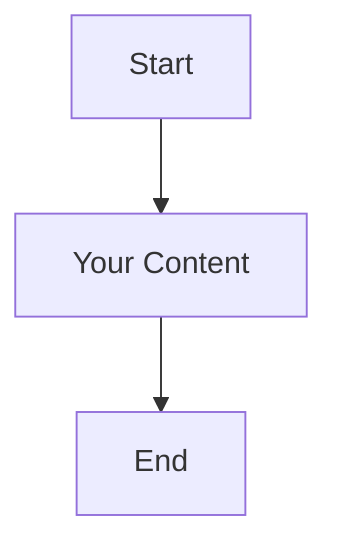

# Confluent Cloud Architecture Diagrams - Azure

This directory contains various architecture diagrams for the Confluent Cloud Terraform project deployed on Azure.

## 📁 Available Diagrams

### 1. **ARCHITECTURE_DIAGRAMS.md** - Mermaid Diagrams
- Comprehensive set of Mermaid flowcharts showing:
  - Overall Azure-based architecture overview
  - Terraform module structure (Root → Azure → Sample Project)
  - Multi-environment resource flow (Sandbox, Dev, QA, UAT, Prod)
  - Azure-specific resource naming conventions
  - Deployment pipeline flow with multiple tfvars files
  - Data flow architecture with Azure cloud integration
  - Environment switching flow for Azure environments

### 2. **confluent-architecture.drawio** - Draw.io Diagram (Available for Creation)
- Interactive Draw.io diagram for detailed visual representations
- Can be edited directly in VS Code with the Draw.io extension
- Perfect for complex Azure infrastructure diagrams

## 🎨 How to Use These Diagrams

### **Mermaid Diagrams (ARCHITECTURE_DIAGRAMS.md)**
1. Open the file in VS Code
2. Use the Mermaid Chart extension to preview diagrams
3. Copy individual diagram code blocks to use elsewhere
4. Diagrams are automatically rendered in GitHub and many markdown viewers

### **Draw.io Diagrams**
1. Install the "Draw.io Integration" extension (already installed)
2. Create a new file with `.drawio` extension
3. VS Code will open the Draw.io editor
4. Create interactive, detailed architecture diagrams

## 🚀 Creating New Diagrams

### **To create a new Mermaid diagram:**

### **To create a new Draw.io diagram:**
1. Right-click in the architecture folder
2. Create new file with `.drawio` extension
3. VS Code will automatically open the Draw.io editor

## 📋 Diagram Types Available

### **Current Diagrams Show:**
- ✅ Azure-based system architecture
- ✅ Terraform module relationships (Root → Azure → Sample Project)
- ✅ Multi-environment resource distribution (5 environments: sandbox, dev, qa, uat, prod)
- ✅ Data flow between components with Azure cloud integration
- ✅ Deployment pipeline workflow with three tfvars configurations
- ✅ Azure-specific resource naming conventions (azure.myorg prefix)
- ✅ Environment switching logic for Azure deployments
- ✅ Flink compute pool integration and status

### **Azure-Specific Features Documented:**
- Azure East US region deployment
- Single zone availability configuration
- Azure-managed Kafka clusters
- Flink compute pools for stream processing
- HTTP source connectors with Azure integration
- Environment-specific cluster management

### **Suggested Additional Diagrams:**
- Azure security architecture (Network security, Identity management)
- Azure cost optimization strategies
- Azure monitoring and alerting with Confluent Cloud
- CI/CD pipeline integration with Azure DevOps
- Disaster recovery and backup strategies on Azure
- Azure networking topology and private endpoints

---

*Architecture documentation for Confluent Cloud Terraform Azure Multi-Environment Setup*
